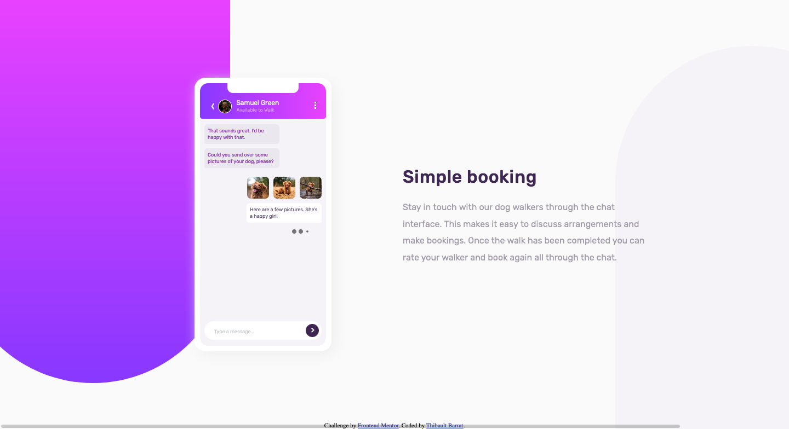

# Frontend Mentor - Chat app CSS illustration solution

This is a solution to the [Chat app CSS illustration challenge on Frontend Mentor](https://www.frontendmentor.io/challenges/chat-app-css-illustration-O5auMkFqY). Frontend Mentor challenges help you improve your coding skills by building realistic projects. 

## Table of contents

- [Overview](#overview)
  - [The challenge](#the-challenge)
  - [Screenshot](#screenshot)
  - [Links](#links)
- [My process](#my-process)
  - [Built with](#built-with)
  - [What I learned](#what-i-learned)
  - [Useful resources](#useful-resources)
- [Author](#author)


## Overview

### The challenge

Users should be able to:

- View the optimal layout for the component depending on their device's screen size
- **Bonus**: See the chat interface animate on the initial load

### Screenshot



### Links

- Solution URL: [https://www.frontendmentor.io/solutions/chat-app-design-using-sass-bem-and-css-animations-y2CLyOZ31](https://www.frontendmentor.io/solutions/chat-app-design-using-sass-bem-and-css-animations-y2CLyOZ31)
- Live Site URL: [https://chat-app-css-illustration-theta-eight.vercel.app/](https://chat-app-css-illustration-theta-eight.vercel.app/)

## My process

### Built with

- Semantic HTML5 markup
- CSS custom properties
- Flexbox
- SASS preprocessor
- BEM methodology

**Note: These are just examples. Delete this note and replace the list above with your own choices**

### What I learned

To realize this project, I learned how to use CSS animations with keyframes :

```css
@keyframes message-load {
    0%, 80%, 100% { 
      transform: scale(0);
    } 40% { 
      transform: scale(1.0);
    }
  }


```

### Useful resources

- [Créez des animations CSS modernes](https://openclassrooms.com/fr/courses/5919246-creez-des-animations-css-modernes) - This is a complete course about CSS animations.
- [Chevrons in CSS](https://codepen.io/egf/pen/jzylw) - This CodePen helped me to draw a chevron for my chat app.
- [Messenger Chat Animation](https://codepen.io/clemens/pen/kXZWOK) - This CodePen hinspired me for my animations.
- [SpinKit](https://tobiasahlin.com/spinkit/) - This kit of CSS loading aniamted spinners helped me to animate the three dots.


## Author

- Website - [Thibault Barrat](https://www.thibault-barrat.com/)
- Frontend Mentor - [@thibault-barrat](https://www.frontendmentor.io/profile/thibault-barrat)
- Twitter - [@Thib_Bar](https://www.twitter.com/Thib_Bar)

